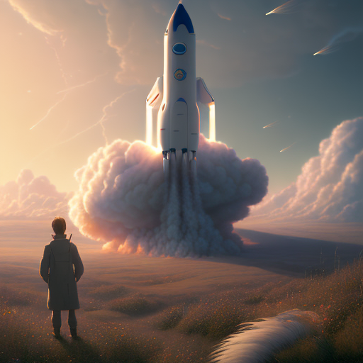
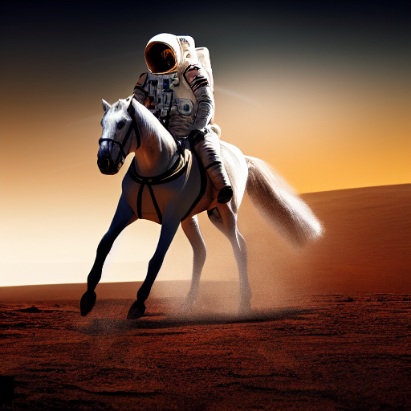

# replicate-fetch

[](https://www.npmjs.com/package/replicate-fetch)  

Fetch api for Midjourney/Openjourney on Replicate

## Usage
### createOpenjourney
```typescript
import { createOpenjourney } from 'replicate-fetch'

createOpenjourney({ prompt: "a cat" })
```

### Example

> mdjrny-v4 style a highly detailed matte painting of a man on a hill watching a rocket launch in the distance by studio ghibli, makoto shinkai, by artgerm, by wlop, by greg rutkowski, volumetric lighting, octane render, 4 k resolution, trending on artstation, masterpiece



### createStableDiffusion
```typescript
import { createStableDiffusion } from 'replicate-fetch'

createStableDiffusion({ prompt: "a cat" })
```

### Example
> an astronaut riding a horse on mars, hd, dramatic lighting



### Other api

```typescript
import { createMidjourney } from 'replicate-fetch'

createMidjourney({ prompt: "a cat" })
```